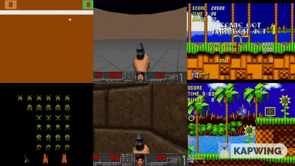

# [Deep Reinforcement Learning](https://deepanshut041.github.io/Reinforcement-Learning/)

This repository contain my work regarding Deep Reinforcment Learning. You will find the main topics organized by squence with there implementaion in PyTorch. Also, It contains some of my project or links on reinforcment learning. You are highly encouraged to modify and play with them!.

- [Notes](#Notes): Implementation of various DRL algorithms with notes regarding them
- [Benchmarking DRL Algorithms on Classic Games](#discrete) (discrete)
- [Benchmarking DRL Algorithms on Unity Ml Agents](#continous) (continous)

___

## Notes

- [Introduction to Reinforcement Learning](./notes/00_Introduction_to_rl/)
- [Dynamic Programing](./notes/01_dynamic_programming/): Implement Dynamic Programming algorithms such as Policy Evaluation, Policy Improvement, Policy Iteration, and Value Iteration.
- [Monte carlo](./notes/02_monte_carlo/): Implement Monte Carlo methods for prediction and control.
- [Temporal Difference](./notes/03_temporal_difference):  Implement Temporal-Difference methods such as Sarsa, Q-Learning, and Expected Sarsa.
- [Deep Q-learning](./notes/04_deepq_learning)
- [Policy Gradients](./notes/05_policy_gradient)
- [Actor Critic (A2C & A3C)](./notes/06_action_critic)
- [Proximal Policy Gradients](./notes/07_ppo)
- [Deep Deterministic Policy Gradient](./notes/08_ddpg)
- [Twin Delayed DDPG](./notes/09_td3)
- [Soft Actor-Critic](./notes/10_sac)

##  Benchmarking DRL Algorithm(Discrete) on Classic Games

We used classic games from OpenAI Gym and Vizdoom as our main testbed to study the behaviour of the following algorithms:

 1. DQN — Deep Q-learning
 2. DDQN — Dueling DQN
 3. Rainbow
 4. Reinforce + Actor Critic
 5. A2C — Advantage Actor Critic
 6. PPO — Proximal Policy Optimization

We compare the results of launch of six algorithms on games from two perspectives: Traning and Testing. Same Deep Neural Network is used for all algorithms. Click on particular game for more information.

| Games | Game Difficulty | Implementations |
|:-:|:-|:-:|
|Atari Ping Pong| :star:|[**Read More**](./cgames/01_ping_pong) |
|Atari Space Invaders| :star::star:|[**Read More**](./cgames/02_space_invader) |
|Doom Defend Center| :star::star::star:|[**Read More**](./cgames/03_doom_defend_center) |
|Doom Deadly Corridor| :star::star::star::star:|[**Read More**](./cgames/04_doom_corridor) |
|Sonic the Hedgehog| :star::star::star::star::star:|[**Read More**](./cgames/05_sonic) |
|Sonic the Hedgehog| :star::star::star::star::star::star:|[**Read More**](./cgames/06_sonic2) |

##  Benchmarking DRL Algorithm(Continous) on Unity Ml Agents

We used mlagents from Unity as our main testbed to study the behaviour of the following algorithms:

 1. PPO - Proximal Policy Optimization
 2. DDPG - Deep Deterministic Policy Gradient
 3. TD3 - Twin Delayed DDPG
 4. SAC - Soft Actor-Critic

We compare the results of launch of six algorithms on games from two perspectives: Traning and Testing. Same Deep Neural Network is used for all algorithms. Click on particular game for more information.

| Games | Game Difficulty | Implementations |
|:-:|:-|:-:|
|3D Balance Ball| :star:|[**Read More**](./mlagents/01_balance_ball) |
|Tennis| :star::star:|[**Read More**](./mlagents/02_tennis) |
|Wall Jump| :star::star::star:|[**Read More**](./mlagents/03_wall_jump) |
|Reacher| :star::star::star::star:|[**Read More**](./mlagents/04_reacher) |
|Soccer Twos| :star::star::star::star::star:|[**Read More**](./mlagents/05_soccer_twos) |
|Walker| :star::star::star::star::star::star:|[**Read More**](./mlagents/06_walker) |

## References

Algorithms implementation resembles below references. Content is only for eduactional purposes no claim on orignality of content or structure of repository.

- `https://github.com/udacity/deep-reinforcement-learning` (Udacity Deep Reinforcement Learning Nanodegree)
- `https://simoninithomas.github.io/Deep_reinforcement_learning_Course` (Deep Reinforcement Learning course by SIMONINI Thomas)
- `https://github.com/higgsfield/RL-Adventure` (RL-Adventure: Dqn by Dulat Yerzat)
- `https://github.com/higgsfield/RL-Adventure-2` (RL-Adventure-2: Policy Gradients by Dulat Yerzat)

## Any questions

If you have any questions, feel free to ask me:

- **Mail**: <a href="mailto:deepanshut041@gmail.com">deepanshut041@gmail.com</a>  
- **Github**: [https://github.com/deepanshut041/Reinforcement-Learning](https://github.com/deepanshut041/Reinforcement-Learning) 
- **Website**: [https://deepanshut041.github.io/Reinforcement-Learning](https://deepanshut041.github.io/Reinforcement-Learning) 
- **Twitter**: <a href="https://twitter.com/deepanshut041">@deepanshut041</a> 

Don't forget to follow me on <a href="https://twitter.com/deepanshut041">twitter</a>, <a href="https://github.com/deepanshut041">github</a> and <a href="https://medium.com/@deepanshut041">Medium</a> to be alerted of the new articles that I publish

## How to help

- **Clap on articles**: Clapping in Medium means that you really like my articles. And the more claps I have, the more my article is shared help them to be much more visible to the deep learning community.
- **Improve our notebooks**: if you found a bug or **a better implementation** you can send a pull request.
