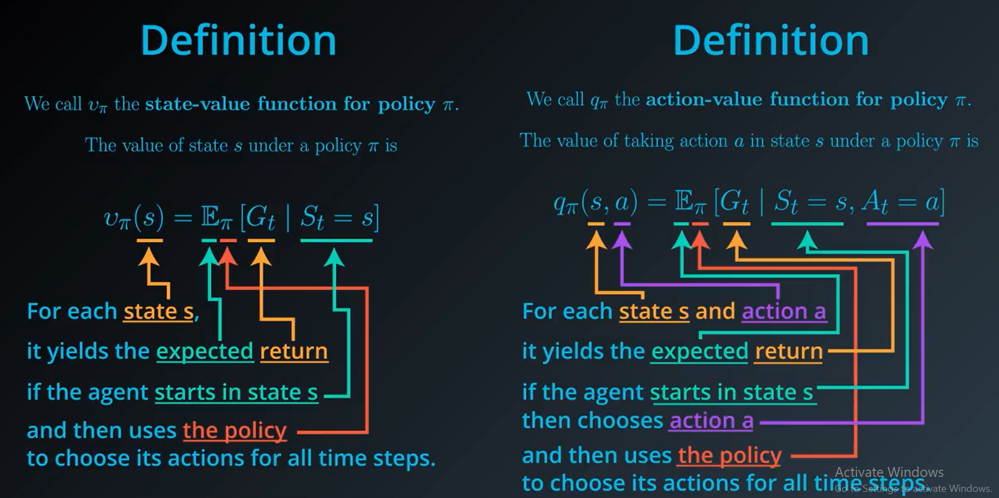
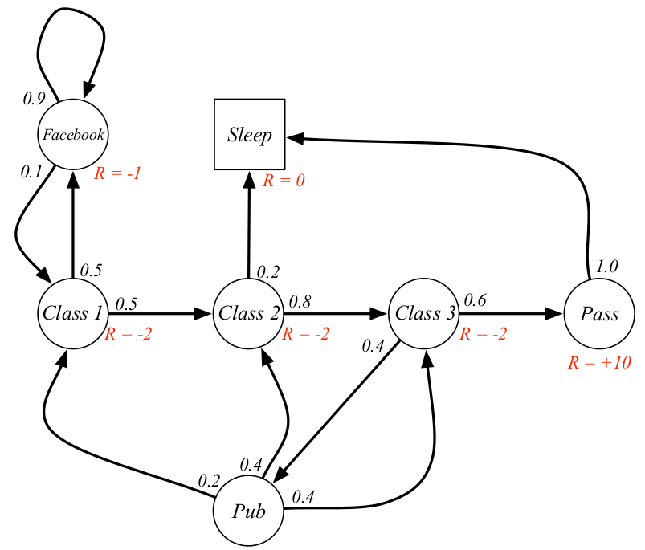

# An introduction to Reinforcement Learning 

  <video autoplay="" src="https://d4mucfpksywv.cloudfront.net/openai-baselines-ppo/knocked-over-stand-up.mp4" loop="" controls="" style="display: block; margin-left: auto; margin-right: auto; margin-bottom:1.5em; width: 100%; max-width: 720px; max-height: 80vh;">
    </video>
  
The key idea behind Reinforcement learning, we have an environment which represents the outside world to the agent and an agent that takes actions, receives observations from the environment that consists of a reward for his action and information of his new state. That reward informs the agent of how good or bad was the taken action, and the observation tells him what is his next state in the environment. Its actions also may affect not only the immediate rewards but rewards for the next situations.

## Key Concepts in Reinforcement Learning

 - **Agent**: The learner and decision maker.

 - **Environment**: Agent's surronding or things it interact with. Agent observe environment and decide to take action which changes environment(it may also change on its own).

 - **State**: A state **s** is a complete description of the state of the world. When agent is able to observe complete state environment is **fully observed** while when only pratial state is observed environment is **partially observed**.

 - **Action Spaces**: The set of all valid actions in a given environment agent is able to perform is called the action space. When actionsare finte they are called **discrete action spaces** and when they are infinte they are called **continuous action spaces**.

 - **Reward**: A reward is a scalar feedback signal it indicates how well the agent is doing at step t. The agent’s sole objective is to maximize the total reward it receives over the long run.
    - The reward signal is the primary basis for altering the policy. 
    - **R(s)** indicates the reward for simply being in the state **S**.
    - **R(S,a)** indicates the reward for being in a state **S** and taking an action **a**.
    - **R(S, a, S')** indicates the reward for being in a state **S**, taking an action **a** and ending up in a state **S'**.

 - **Policy**:  It is agent behavior function or simply agent's behavior. The policy is a mapping from perceived states of the environment to actions to be taken when in those states or simply it maps the action to state.There are two types of policy Deterministic and Stochastic.
   - **Deterministic policy** is a mapping ***π:S → A***. For each state **s∈S**, it yields the action **a∈A** that the agent will choose while in state *s*.
   - **Stochastic policy** is a mapping ***π:S × A →*** **[0,1]**. For each state **s∈S** and action **a∈A**, it yields the probability **π(a∣s)** that the agent chooses action aa while in state *s*.

 - **Value Function**: It is a prediction of future reward. The value of a state is the total amount of reward an agent can expect to accumulate over the future, starting from that state. Used to evaluate the goodness and badness of a state. There are two types of value functions **State Value Function** and **Action Value Function**
    
   

 

 - **Model**: A model predicts what environment will do next. Models are used for planning, by which we mean any way of deciding on a course of action by considering possible future situations before they are actually experienced.
    - A Model (sometimes called Transition Model) gives an action’s effect in a state. In particular, **T(S, a, S')** defines a transition **T** where being in state **S** and taking an action **a** takes us to state **S'** (**S** and **S'** may be same).
    - For stochastic actions (noisy, non-deterministic) we also define a probability **P(S’|S,a)** which represents the probability of reaching a state **S'** if action **a** is taken in state **S**.
    - Methods for solving reinforcement learning problems that use models and planning are called model-based methods, as opposed to simpler model-free methods.

## Bellman Equations
  ***The value of your starting point is the reward you expect to get from being there, plus the value of wherever you land next.***

Both Value functions obey Bellman equations. The Bellman equations for the state and actions value functions are

 

## Markov Decision Processes

### Markov Processes

 - **Markov property**: Once the current state is known, the history of information encountered so far may be thrown away, and that state is a sufficient statistic that gives us the same characterization of the future as if we have all the history.

<strong>P[St+1 | St] = P[St+1 | S1, S2 .......... St]</strong>

 - **Transition probability**:  It’s a probability distribution over next possible successor states, given the current state, i.e. the agent is in some state, there is a probability to go to the first state, and another probability to go to the second state and so on.

 - **State transition matrix**: It defines transition probabilities from all state **S** to successor state **S'**. 

A Markov process is a memory-less random process, i.e. a sequence of random states **S1**, **S2**, ..... with the Markov property. A Markov process or Markov chain is a tuple **(S, P)** on state space **S**, and transition function **P**. The dynamics of the system can be defined by these two components **S** and **P**.

### Markov Reward Process

A Markov Reward Process is a Markov process with value judgment, saying how much reward accumulated through some particular sequence that we sampled. An MRP is a tuple **(S, P, R, 𝛾)** where **S** is a finite state space, **P** is the state transition probability function, **R** is a reward function where it says how much immediate reward we expect to get from state **S** at the moment.

<strong>Rs = [Rt+1 | St = S]</strong>

There is the notion of the return **Gt**, which is the total discounted rewards from time step **t**. This is what we care about, the goal is to maximise this return

  

**𝛾** is a discount factor, where **𝛾** ∈ [0, 1]. It informs the agent of how much it should care about rewards now to rewards in the future. If (**𝛾** = 0), that means the agent is short-sighted, in other words, it only cares about the first reward. If (**𝛾** = 1), that means the agent is far-sighted, i.e. it cares about all future rewards.

### Markov Decision Process

An MDP is a Markov Reward Process with decisions, it’s an environment in which all states are Markov. This is what we want to solve. An MDP is a tuple **(S, A, P, R, 𝛾)**, where 

* `S` is the set of all valid states,
* `A` is the set of all valid actions,
* `R` is the reward function,
* `P` is the transition probability function, with `P(s'|s,a)` being the probability of transitioning into state `s'` if you start in state `s` and take action `a`,
* `𝛾` is the discount factor.

## Types of Reinforcement Learning Agents
 - **Value Based Agent**, the agent will evaluate all the states in the state space, and the policy will be kind of implicit, i.e. the value function tells the agent how good is each action in a particular state and the agent will choose the best one.
 - **Policy Based Agent**, instead of representing the value function inside the agent, we explicitly represent the policy. The agent searches for the optimal action-value function which in turn will enable it to act optimally.
 - **Actor-Critic Agent**, this agent is a value-based and policy-based agent. It’s an agent that stores both of the policy, and how much reward it is getting from each state.
 - **Model-Based Agent**, the agent tries to build a model of how the environment works, and then plan to get the best possible behavior.
 - **Model-Free Agent**, here the agent doesn’t try to understand the environment, i.e. it doesn’t try to build the dynamics. Instead we go directly to the policy and/or value function. We just see experience and try to figure out a policy of how to behave optimally to get the most possible rewards.

## Famous Deep RL Algorithms

## References
https://spinningup.openai.com/en/latest/spinningup/rl_intro.html